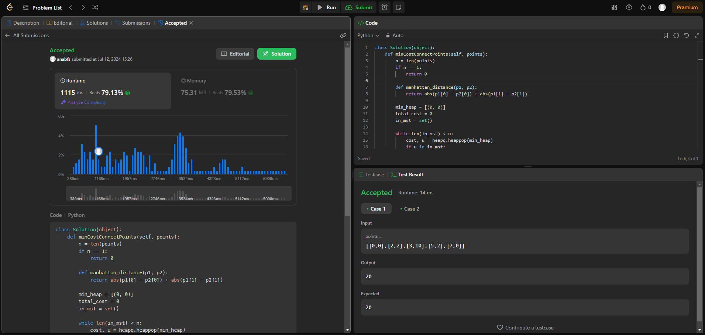

# Grafos 2 - Online Judge

**Número da Lista**: 21 
**Conteúdo da Disciplina**: Grafos2 

## Alunos
|Matrícula | Aluno |
| -- | -- |
| 18/0097181  |  Ana Beatriz Santos |
| 20/0023748  |  Marcos Santos Bittar |

## Sobre 
Descreva os objetivos do seu projeto e como ele funciona. 

## Apresentação

## Screenshots

### Exercício 1 - Clone Graph

Dificuldade: Médio  
Link: [Min Cost to Connect All Points](https://leetcode.com/problems/min-cost-to-connect-all-points/description/) 
Solução: [Código](assets/codes/min_cost.py) 
O problema consiste em modelar um conjunto de pontos como nós em um grafo, onde cada aresta tem peso igual à distância Manhattan entre os pontos. Para encontrar a Árvore Geradora Mínima (MST), usamos o algoritmo de Prim, ideal para grafos completos densos devido à sua eficiência na construção da MST

## Instalação 
**Linguagem**: xxxxxx 
**Framework**: (caso exista) 
Descreva os pré-requisitos para rodar o seu projeto e os comandos necessários.

## Uso 
Explique como usar seu projeto caso haja algum passo a passo após o comando de execução.

## Outros 
Quaisquer outras informações sobre seu projeto podem ser descritas abaixo.