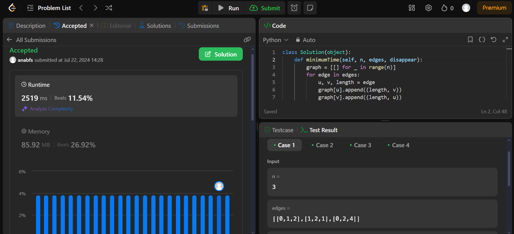

# Grafos 2 - Online Judge

**Número da Lista**: 21 
**Conteúdo da Disciplina**: Grafos2 

## Alunos

|Matrícula | Aluno |
| -- | -- |
| 18/0097181  |  Ana Beatriz Santos |
| 20/0023748  |  Marcos Santos Bittar |

## Sobre

Repositório com resoluções de problemas de grafos do [LeetCode](https://leetcode.com/).

## Apresentação

## Screenshots

### Exercício 1 - Min Cost to Connect All Points

Dificuldade: Médio  
Link: [Min Cost to Connect All Points](https://leetcode.com/problems/min-cost-to-connect-all-points/description/) 
Solução: [Código](assets/codes/min_cost.py) 
O problema consiste em modelar um conjunto de pontos como nós em um grafo, onde cada aresta tem peso igual à distância Manhattan entre os pontos. Para encontrar a Árvore Geradora Mínima (MST), usamos o algoritmo de Prim, ideal para grafos completos densos devido à sua eficiência na construção da MST

### Exercício 2 - Find Critical and Pseudo-Critical Edges in Minimum Spanning Tree

Dificuldade: Difícil  
Link: [Find Critical and Pseudo-Critical Edges in Minimum Spanning Tree](https://leetcode.com/problems/find-critical-and-pseudo-critical-edges-in-minimum-spanning-tree/description/) 
Solução: [Código](assets/codes/find_pseudo.py) 
Para resolver o problema, utilizamos uma combinação do algoritmo Union-Find (ou Disjoint Set Union, DSU) com Kruskal para calcular a Árvore de Extensão Mínima (MST) de um grafo ponderado não direcionado.

### Exercício 3 - Minimum Time to Visit Disappearing Nodes

Dificuldade: Médio  
Link: [Minimum Time to Visit Disappearing Nodes](https://leetcode.com/problems/minimum-time-to-visit-disappearing-nodes/description/) 
Solução: [Código](assets/codes/min_time.py) 
Para resolver o problema, usamos o algoritmo de Dijkstra para calcular a menor distância dos nós a partir do nó inicial (nó 0). A ideia é usar uma fila de prioridade para explorar os nós com menor custo e verificar se podemos alcançar cada nó antes que ele desapareça.

## Instalação

**Linguagem**: Python 
Você precisará apenas criar uma conta no [LeetCode](https://leetcode.com/).

## Uso

Para executar o trabalho basta abrir o link do exercício e copiar e colar o código.
